# Electrical Instructions

---
## Main COUG-UV PCB

Open the .brd and .sch files (found below) in a PCB design software. For our purposes we will use Eagle.

For our PCB production we used JLCPCB. In order to process the file correctly for JlCPCB you must first download their custom CAM processor. [Custom Eagle JLCPCB CAM](https://jlcpcb.com/help/article/9-How-to-Generate-Gerber-and-Drill-Files-in-Autodesk-Eagle)

Now return to Eagle under the the .brd tab. Within the toolbar line across the top you will see the cam processor. Open ie and load in the custom processor you downloaded earlier. When it is run you will end up with a .zip file which you will upload to the JLCPCB website.

### Links to Main PCB board (.brd and .sch)

**.brd:**
[COUG_powerboard.brd link](https://byu.box.com/s/raniskul3jnl1tf10c4lscgmdiiq0gin)

**.sch:**
[COUG_powerboard.sch link](https://byu.box.com/s/jcqulffcyls4dua039p1142ic2lz8b0v)

{: .note }
> Put these files in the same folder. This is essential for PCB design software like Eagle to recognize they go together.

## Strobe Light PCB

Utilizing the same method as above, you can send the strobe light PCB out for production. (Links found below)

### Links to Strobe PCB board (.brd and .sch)

**.brd:**
[.brd link](https://byu.box.com/s/raniskul3jnl1tf10c4lscgmdiiq0gin)

**.sch:**
[.sch link](https://byu.box.com/s/jcqulffcyls4dua039p1142ic2lz8b0v)

---

## PCB Assembly
\

This is the milled board from JLCPCB. To begin soldering the components onto the board I would recommend doing it in the following order.

### LittleFuse and TVS Diode
\
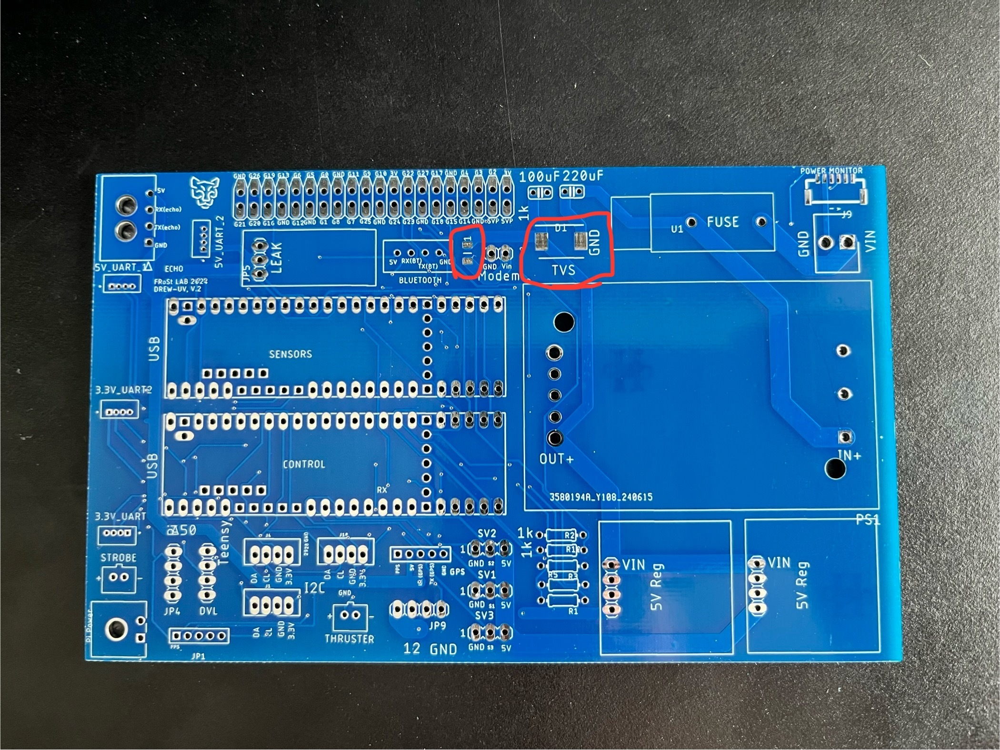

{: .note }
> Ensure you solder the TVS diode in the correct orientation.

### Headers
\
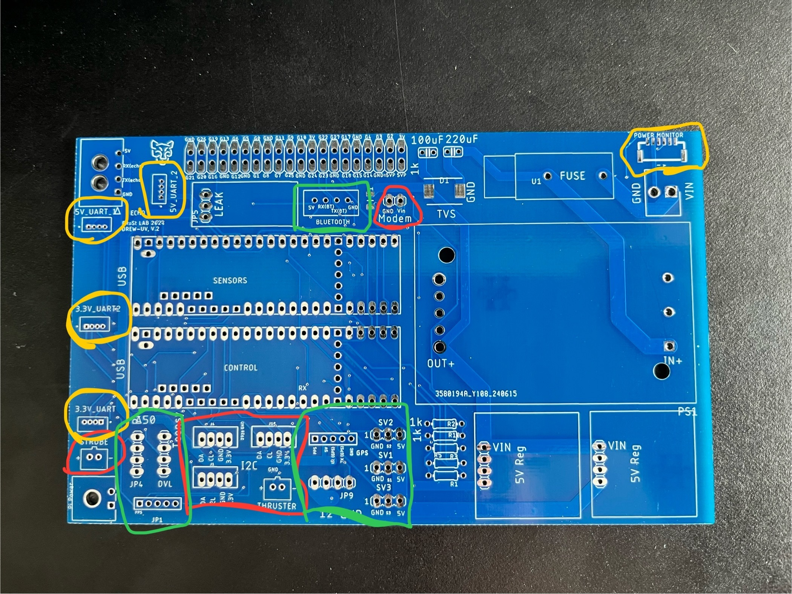

#### Solder the headers in this order.
1. Yellow (1.25 mm headers)
2. Red (2.0 mm headers)
3. Green (2.54 mm headers)

{: .note }
> I used the 1.25mm headers unconventially by soldering surface mount headers into through hole connections. I find it to be easier and sturdier this way.

### Final Components
\
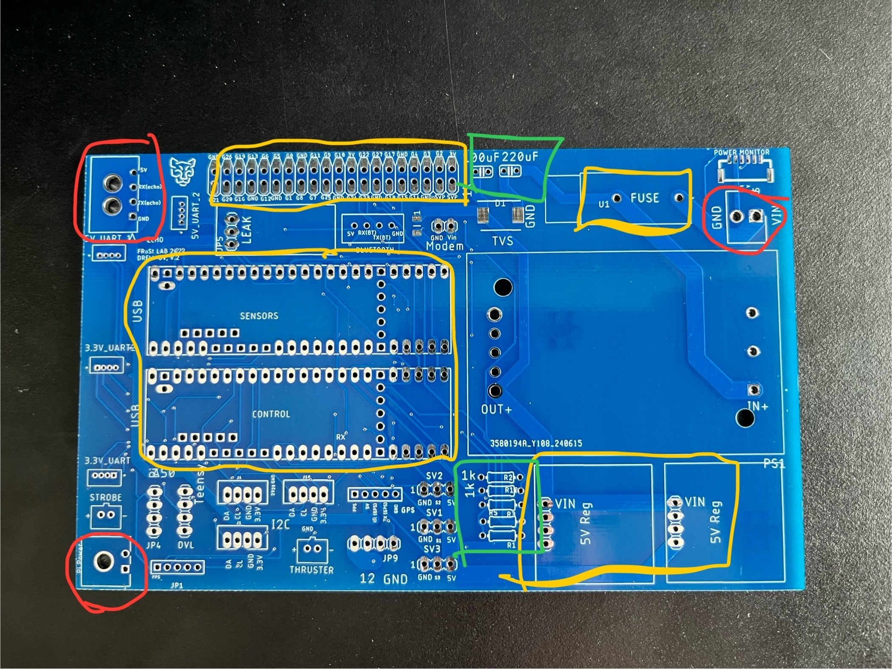

#### Solder the components in this order.
1. Red (Molex headers and Fuse)
2. Yellow (Header pins)
3. Green (Resistors and Capacitors)
4. DC-DC converter

### Completed Board
\
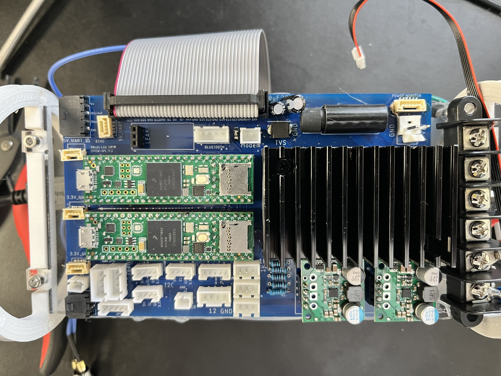

The finished board should look something like this.

---

## Thruster and Servos

To complete this step you will need the tailcone and rear extension parts printed.

Make sure the wires for the servo and thruster is threaded from the outside of the tailcone through their holes and then through the penetrators. As shown below.

\
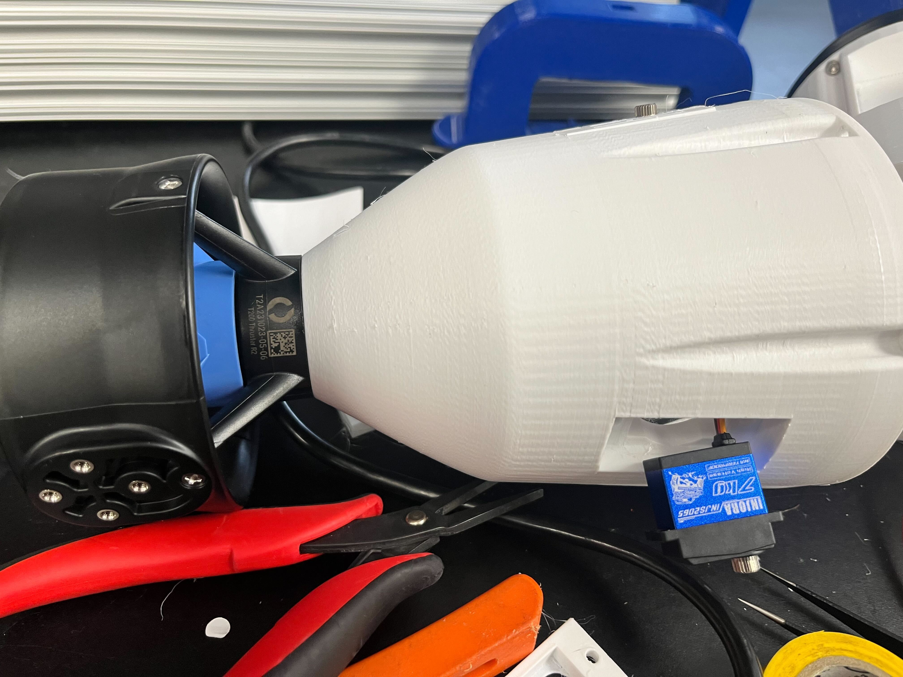

\
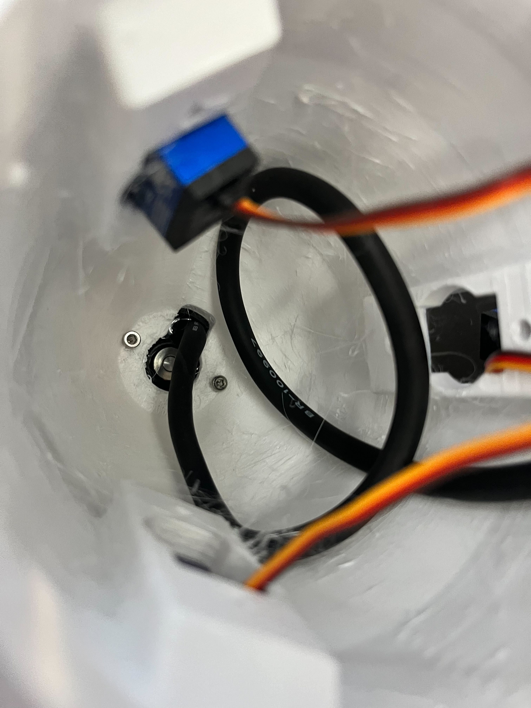

POV inside the tailcone

{: .note }
> You may need to cut off the connectors on the servos to fit them through the penetrators.

\
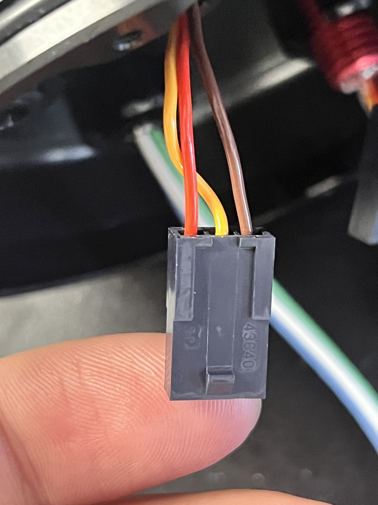

After you have the wires threaded through the penetrators you can fit them to the Molex micro connectors. You will need to crimp the ends so that they fit into the connector as shown. 

\
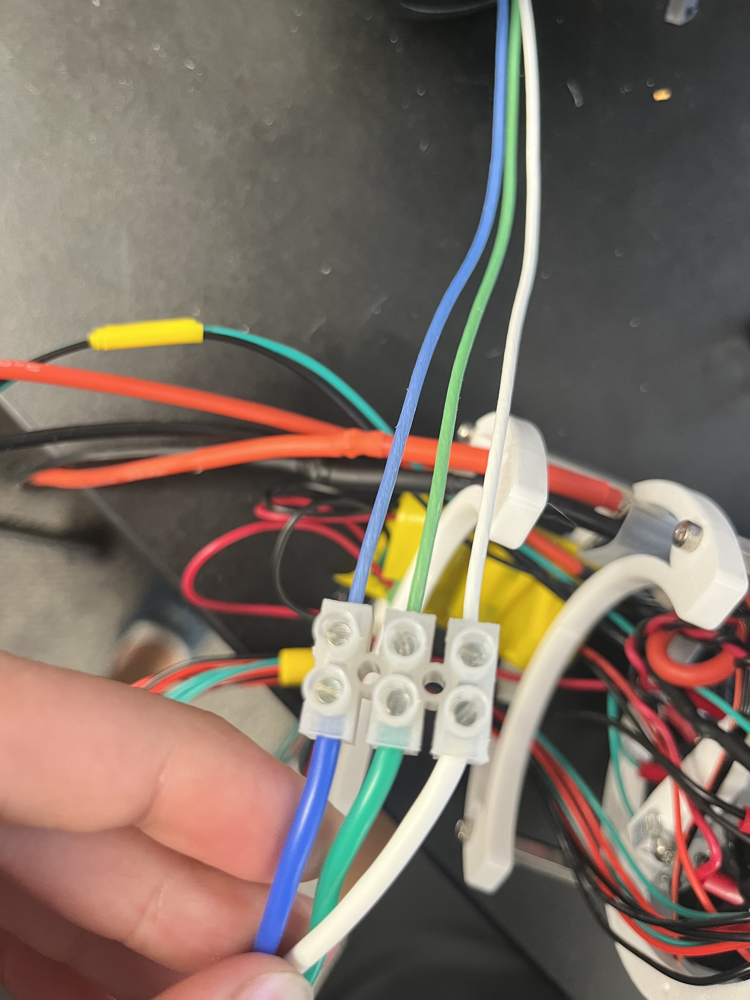

The three wires from the thruster should be secured in a screw terminal as shown.

---

## Electronics Tray

### Power Rails
The Power Rails will be mounted on the back of the electronics tray as shown.

To mount these correctly you need to first break off the plastic shielding around the bottom pegs. You will then need to bend one of the side prongs into the middle and break off the thin section at the top. Here is an example.

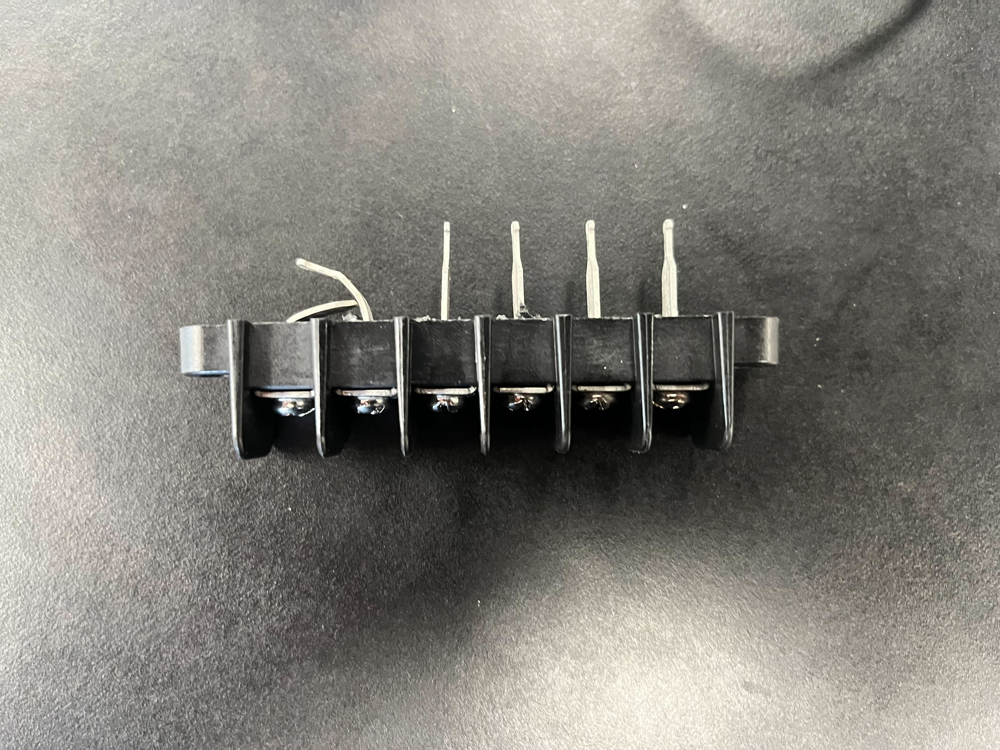

Following that you will need to bend the rest of the pegs over onto the one next to it as shown in this image.

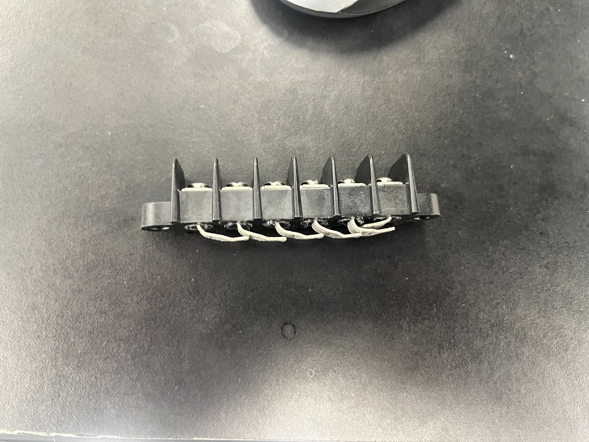

The prongs will then need to be soldered together so that they are all connected. Be liberal with the solder.

Repeat this process once more.

After, you will need to align one side of these Power rails on the electronics tray so that a hole on the side lines up with the hole in the tray. You will then put an M5x25mm screw through one rail, the tray hole, and through the other rail so that they are aligned and somewhat held in place. Finally, after they are positioned correctly, hot glue can be applied all around the base to insulate as well as secure them in place.

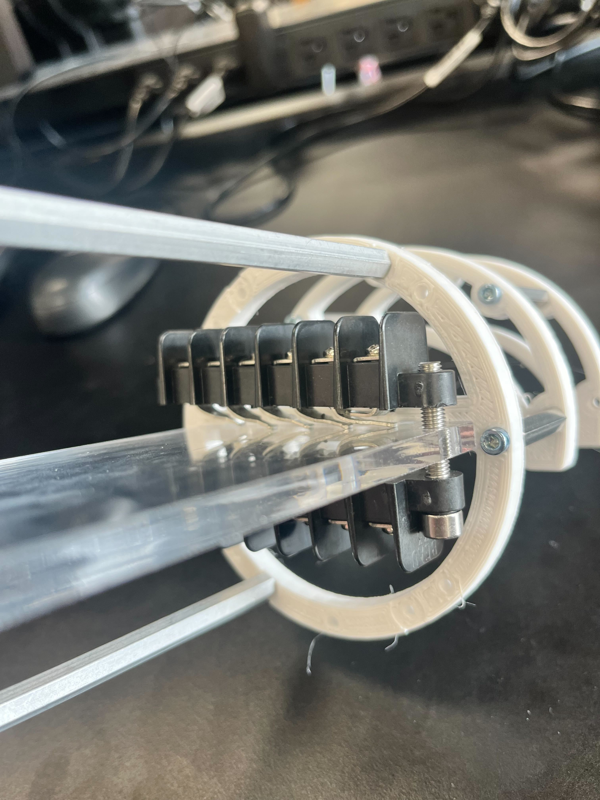

This is what the final result will look like before gluing it in place.

---

