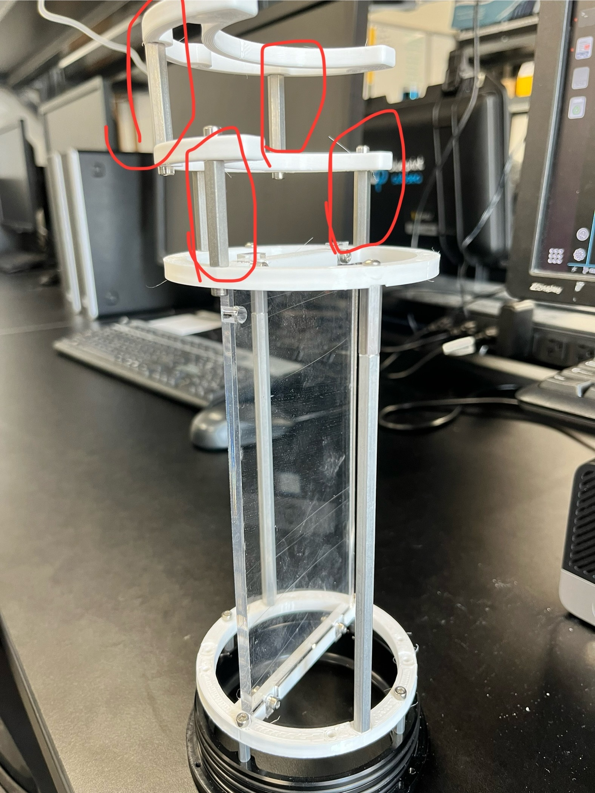
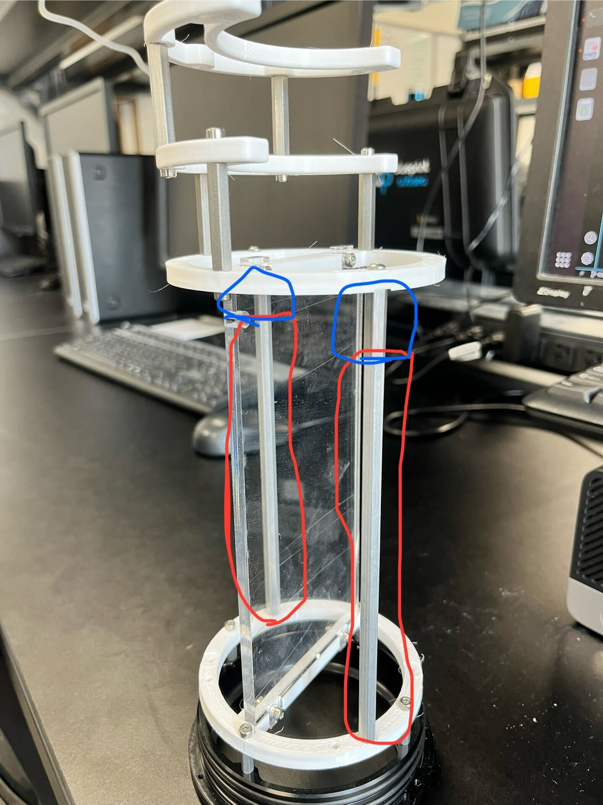
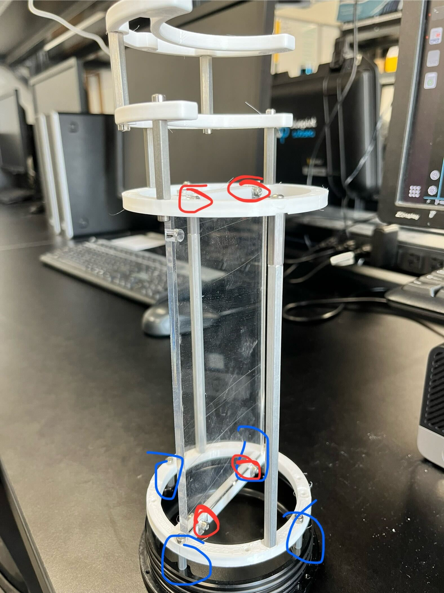

# Mechanical Instructions

---

## Interior Frame

The first thing to assemble should be the interior frame. That will be the structure for all of the electronics inside the enclosure.

You will need these four 3d printed pieces.
[insert photo of parts]

You will also need:
- 4 Male-Female Hex Standoff M3x12mm
- 5 Female-Female Hex Standoff M3x31mm
- 2 Female-Female Hex Standoff 4-40x6in
- 2 Male-Female Hex Standoff 4-40x7/8in 
- 18 M3X12 socket cap screws
- 4 M3 nuts
- 4 philips head screw 4-40 X 1/2" 
- Electronics tray

\

M3 31mm standoffs.

\

4-40 standoffs.

\

12mm standoffs (Blue), M3 screw and nut for electronics tray.

{: .note }
> Make sure the electronics tray is in the correct orientation, otherwise the usb connections on the raspberry pi will be blocked.

