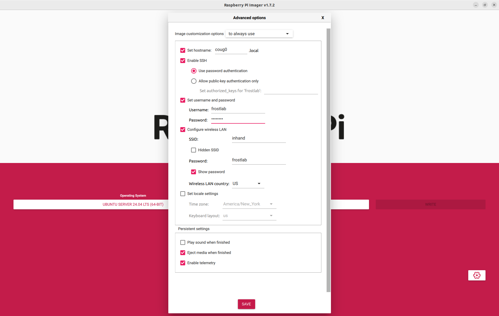

# Instructions

---

## Recommended Flash Settings
\


{: .note }
> We recommend using a Raspberry Pi 5 -- we've had some hardware upload problems with other versions, including the 4B.

---

## Setting Up a New Coug-UV
```bash
# from the newly-flashed Raspberry Pi
git clone https://github.com/snelsondurrant/CougarsSetup.git
cd ~/CougarsSetup
bash setup.sh
 
# download and run the latest Docker image
bash docker.sh
```