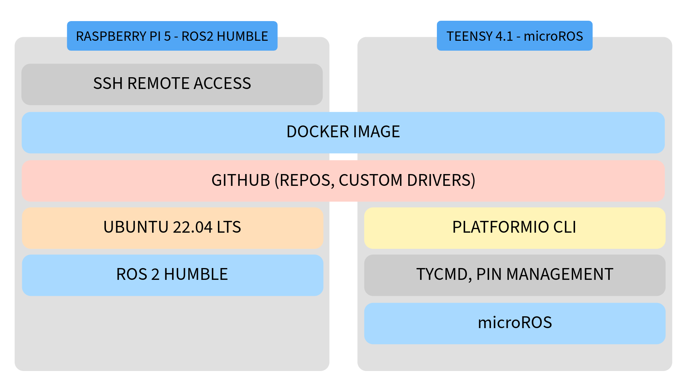
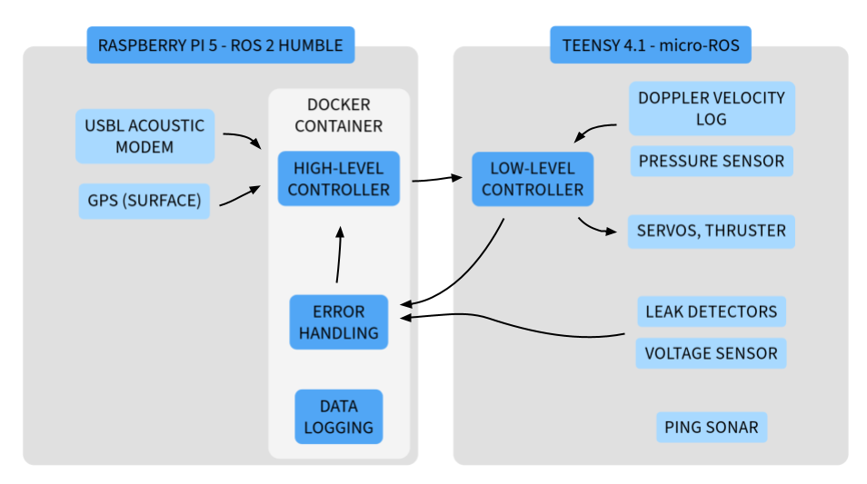

# Overview

---

## Useful Links
\
[https://hub.docker.com/repository/docker/snelsondurrant/cougars/general](https://hub.docker.com/repository/docker/snelsondurrant/cougars/general)

[https://github.com/snelsondurrant/CougarsSetup.git](https://github.com/snelsondurrant/CougarsSetup.git)

[https://github.com/snelsondurrant/CougarsRPi.git](https://github.com/snelsondurrant/CougarsRPi.git)

[https://github.com/snelsondurrant/CougarsTeensy.git](https://github.com/snelsondurrant/CougarsTeensy.git)

[https://github.com/snelsondurrant/CougarsDocs.git](https://github.com/snelsondurrant/CougarsDocs.git)

{: .note }
> More in-depth documentation is included in the "README.md" files for all of the GitHub repos above, in addition to header comments in other important files.

---

## Development Stack Diagram

---

## Robot Operating System Graph

